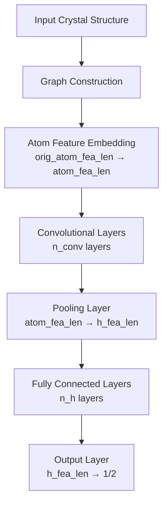

# Crystal Graph Convolutional Neural Network (CGCNN)

## Introduction

The Crystal Graph Convolutional Neural Network (CGCNN) is a deep learning framework designed for predicting material properties based on their crystal structures. It was introduced in the paper ["Crystal Graph Convolutional Neural Networks for an Accurate and Interpretable Prediction of Material Properties"](https://arxiv.org/pdf/1710.10324).

## Model Architecture

The CGCNN model consists of several key components:

1. **Graph Representation**: Crystal structures are represented as graphs where:
   - Nodes represent atoms
   - Edges represent bonds between atoms
   - Node features encode atom types
   - Edge features encode bond information

2. **Convolutional Layers**: The core of CGCNN is its convolutional layers that update atom features based on their neighbors.

### Architecture Overview



### Model Parameters

The model architecture can be configured with the following parameters:
- `orig_atom_fea_len`: Length of original atom features (default: 92 for one-hot encoded elements)
- `nbr_fea_len`: Length of neighbor features (default: 41 for bond information)
- `atom_fea_len`: Length of atom features after embedding (default: 64)
- `n_conv`: Number of convolutional layers (default: 3)
- `h_fea_len`: Length of hidden features in fully connected layers (default: 128)
- `n_h`: Number of hidden fully connected layers (default: 1)

### Mathematical Formulation

The convolutional operation in CGCNN can be expressed as:

$$
\mathbf{v}_i^{(t+1)} = \mathbf{v}_i^{(t)} + \sum_{j \in \mathcal{N}(i)} \sigma(\mathbf{z}_{(i,j)}^{(t)}) \odot g(\mathbf{z}_{(i,j)}^{(t)})
$$

where:
- $\mathbf{v}_i^{(t)}$ is the feature vector of atom $i$ at layer $t$
- $\mathcal{N}(i)$ is the set of neighbors of atom $i$
- $\mathbf{z}_{(i,j)}^{(t)} = \mathbf{W}_c^{(t)} [\mathbf{v}_i^{(t)} \oplus \mathbf{v}_j^{(t)} \oplus \mathbf{u}_{(i,j)}]$
- $\sigma$ is the sigmoid function (gate)
- $g$ is the softplus function
- $\mathbf{u}_{(i,j)}$ are the edge features
- $\mathbf{W}_c^{(t)}$ are the learnable weights

## Implementation Details

### ConvLayer

The convolutional layer is implemented in the `ConvLayer` class with the following components:
- Input dimension: `2 * atom_fea_len + nbr_fea_len`
- Output dimension: `2 * atom_fea_len`
- Batch normalization layers: 2
- Activation functions: Sigmoid and Softplus

```python
class ConvLayer(nn.Module):
    def __init__(self, atom_fea_len: int, nbr_fea_len: int) -> None:
        super(ConvLayer, self).__init__()
        self.atom_fea_len = atom_fea_len
        self.nbr_fea_len = nbr_fea_len
        self.fc_full = nn.Linear(
            2 * self.atom_fea_len + self.nbr_fea_len, 2 * self.atom_fea_len
        )
        self.sigmoid = nn.Sigmoid()
        self.softplus1 = nn.Softplus()
        self.bn1 = nn.BatchNorm1d(2 * self.atom_fea_len)
        self.bn2 = nn.BatchNorm1d(self.atom_fea_len)
        self.softplus2 = nn.Softplus()
```

The forward pass implements the convolutional operation:

```python
def forward(self, atom_in_fea, nbr_fea, nbr_fea_idx):
    N, M = nbr_fea_idx.shape
    # Get neighbor atom features
    atom_nbr_fea = atom_in_fea[nbr_fea_idx, :]
    # Concatenate features
    total_nbr_fea = torch.cat([
        atom_in_fea.unsqueeze(1).expand(N, M, self.atom_fea_len),
        atom_nbr_fea,
        nbr_fea,
    ], dim=2)
    # Apply convolution
    total_gated_fea = self.fc_full(total_nbr_fea)
    total_gated_fea = self.bn1(
        total_gated_fea.view(-1, self.atom_fea_len * 2)
    ).view(N, M, self.atom_fea_len * 2)
    # Split into filter and core
    nbr_filter, nbr_core = total_gated_fea.chunk(2, dim=2)
    nbr_filter = self.sigmoid(nbr_filter)
    nbr_core = self.softplus1(nbr_core)
    # Sum over neighbors
    nbr_sumed = torch.sum(nbr_filter * nbr_core, dim=1)
    nbr_sumed = self.bn2(nbr_sumed)
    # Add residual connection
    out = self.softplus2(atom_in_fea + nbr_sumed)
    return out
```

### CrystalGraphConvNet

The main model class combines multiple components with the following structure:
1. **Embedding Layer**:
   - Input: `orig_atom_fea_len`
   - Output: `atom_fea_len`
   - Linear transformation

2. **Convolutional Layers**:
   - Number of layers: `n_conv`
   - Each layer maintains `atom_fea_len` dimensions
   - Includes batch normalization and residual connections

3. **Pooling Layer**:
   - Input: `atom_fea_len`
   - Output: `h_fea_len`
   - Aggregates atom features to crystal-level features

4. **Fully Connected Layers**:
   - Number of layers: `n_h`
   - Each layer maintains `h_fea_len` dimensions
   - Includes Softplus activation

5. **Output Layer**:
   - Input: `h_fea_len`
   - Output: 1 (regression) or 2 (classification)
   - Linear transformation

```python
class CrystalGraphConvNet(nn.Module):
    def __init__(
        self,
        orig_atom_fea_len: int,
        nbr_fea_len: int,
        atom_fea_len: int = 64,
        n_conv: int = 3,
        h_fea_len: int = 128,
        n_h: int = 1,
        classification: bool = False,
    ) -> None:
        super(CrystalGraphConvNet, self).__init__()
        self.classification = classification
        self.embedding = nn.Linear(orig_atom_fea_len, atom_fea_len)
        self.convs = nn.ModuleList([
            ConvLayer(atom_fea_len=atom_fea_len, nbr_fea_len=nbr_fea_len)
            for _ in range(n_conv)
        ])
        self.conv_to_fc = nn.Linear(atom_fea_len, h_fea_len)
        self.conv_to_fc_softplus = nn.Softplus()
        if n_h > 1:
            self.fcs = nn.ModuleList([
                nn.Linear(h_fea_len, h_fea_len) for _ in range(n_h - 1)
            ])
            self.softpluses = nn.ModuleList([nn.Softplus() for _ in range(n_h - 1)])
        self.fc_out = nn.Linear(h_fea_len, 1 if not classification else 2)
```

The forward pass includes:
1. Atom feature embedding
2. Multiple convolutional layers
3. Pooling to get crystal-level features
4. Fully connected layers for final prediction

```python
def forward(self, atom_fea, nbr_fea, nbr_fea_idx, crystal_atom_idx):
    # Embed atom features
    atom_fea = self.embedding(atom_fea)
    # Apply convolutional layers
    for conv_func in self.convs:
        atom_fea = conv_func(atom_fea, nbr_fea, nbr_fea_idx)
    # Pool to get crystal features
    crys_fea = self.pooling(atom_fea, crystal_atom_idx)
    # Apply fully connected layers
    crys_fea = self.conv_to_fc(self.conv_to_fc_softplus(crys_fea))
    crys_fea = self.conv_to_fc_softplus(crys_fea)
    if hasattr(self, "fcs") and hasattr(self, "softpluses"):
        for fc, softplus in zip(self.fcs, self.softpluses):
            crys_fea = softplus(fc(crys_fea))
    # Final prediction
    out = self.fc_out(crys_fea)
    return out, crys_fea
```

## Key Features

1. **Graph Representation**: Captures the crystal structure as a graph
2. **Convolutional Layers**: Learn local patterns in the crystal structure
3. **Pooling**: Aggregates atom features to crystal-level features
4. **Residual Connections**: Helps with training deep networks
5. **Batch Normalization**: Stabilizes training
6. **Softplus Activation**: Ensures positive feature values

## Applications

CGCNN has been successfully applied to predict various material properties:
- Formation energy
- Band gap
- Elastic properties
- Thermal properties
- Electronic properties

## References

1. [Crystal Graph Convolutional Neural Networks for an Accurate and Interpretable Prediction of Material Properties](https://arxiv.org/pdf/1710.10324)
2. [CGCNN GitHub Repository](https://github.com/txie-93/cgcnn) 