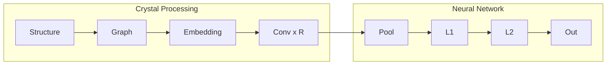

# Crystal Graph Convolutional Neural Network (CGCNN)

## Introduction

The Crystal Graph Convolutional Neural Network (CGCNN) is a deep learning framework designed for predicting material properties based on their crystal structures. It was introduced in the paper ["Crystal Graph Convolutional Neural Networks for an Accurate and Interpretable Prediction of Material Properties"](https://journals.aps.org/prl/abstract/10.1103/PhysRevLett.120.145301).

## Graph Representation

The main idea in CGCNN is to represent the crystal structure by a crystal graph that encodes both atomic information and bonding interactions between atoms. A crystal graph $\mathcal{G}$ is an udirected multigraph which is defined by nodes representing atoms and edges representing connections between atoms in a crystal.

Each node $i$ is represented by a feature vector $v_i$, encoding the property of the atom corresponding to node $i$. Similarly, each edge $(i,j)_k$ is represented by a feature vector $u_{(i,j)_k}$ corresponding to the $k$th bond connecting atom $i$ and atom $j$.

The crystal graph is unlike normal graphs since it allows multiple edges between the same pair of end nodes, a characteristic for crystal graphs due to their periodicity, in contrast to molecular graphs. 


## Model Architecture

The convolutional neural networks built on top of the crystal graph consist of two major components: convolutional layers and pooling layers. The convolutional layers iteratively update the atom feature vector $v_i$ by "convolution" with surrounding atoms and bonds with a nonlinear graph convolution function,

$$
v_i^{(t+1)} = \text{Conv}\left(v_i^{(t)}, v_j^{(t)}, \mathbf{u}_{(i,j)_k}\right), \quad (i,j)_k \in \mathcal{G}. \tag{1}
$$

After R convolutions, the network automatically learns the  feature vector $v_i^(R)$ for each atom by iteratively including its surrounding environment. The pooling layer is then used for producing an overall feature vector $v_c$ for the crystal, which can be represented by a pooling function,

$$
v_c = \text{Pool}(v_0^{(0)}, v_1^{(0)}, \ldots, v_N^{(0)}, \ldots, v_N^{(R)}) \tag{2}
$$

that satisfies permutational invariance with respect to atom indexing and size invariance with respect to unit cell choice. In this work, a normalized summation is used as the pooling function for simplicity, but other functions can also be used. In addition to the convolutional and pooling layers, two fully connected hidden layers with the depths of L1 and L2 are added to capture the complex mapping between crystal structure and property. Finally, an output layer is used to connect the L2 hidden layer to predict the target property $\hat{y}$.



### Model Parameters

The model architecture can be configured with the following parameters:
- `orig_atom_fea_len`: Length of original atom features (default: 92 for one-hot encoded elements)
- `nbr_fea_len`: Length of neighbor features (default: 41 for bond information)
- `atom_fea_len`: Length of atom features after embedding (default: 64)
- `n_conv`: Number of convolutional layers (default: 3)
- `h_fea_len`: Length of hidden features in fully connected layers (default: 128)
- `n_h`: Number of hidden fully connected layers (default: 1)

### Mathematical Formulation

The convolutional operation in CGCNN can be expressed as:

$$
\mathbf{v}_i^{(t+1)} = \mathbf{v}_i^{(t)} + \sum_{j \in \mathcal{N}(i)} \sigma(\mathbf{z}_{(i,j)}^{(t)}) \odot g(\mathbf{z}_{(i,j)}^{(t)})
$$

where:
- $\mathbf{v}_i^{(t)}$ is the feature vector of atom $i$ at layer $t$
- $\mathcal{N}(i)$ is the set of neighbors of atom $i$
- $\mathbf{z}_{(i,j)}^{(t)} = \mathbf{W}_c^{(t)} [\mathbf{v}_i^{(t)} \oplus \mathbf{v}_j^{(t)} \oplus \mathbf{u}_{(i,j)}]$
- $\sigma$ is the sigmoid function (gate)
- $g$ is the softplus function
- $\mathbf{u}_{(i,j)}$ are the edge features
- $\mathbf{W}_c^{(t)}$ are the learnable weights

## Implementation Details

### ConvLayer

The convolutional layer is implemented in the `ConvLayer` class with the following components:
- Input dimension: `2 * atom_fea_len + nbr_fea_len`
- Output dimension: `2 * atom_fea_len`
- Batch normalization layers: 2
- Activation functions: Sigmoid and Softplus

```python
class ConvLayer(nn.Module):
    def __init__(self, atom_fea_len: int, nbr_fea_len: int) -> None:
        super(ConvLayer, self).__init__()
        self.atom_fea_len = atom_fea_len
        self.nbr_fea_len = nbr_fea_len
        self.fc_full = nn.Linear(
            2 * self.atom_fea_len + self.nbr_fea_len, 2 * self.atom_fea_len
        )
        self.sigmoid = nn.Sigmoid()
        self.softplus1 = nn.Softplus()
        self.bn1 = nn.BatchNorm1d(2 * self.atom_fea_len)
        self.bn2 = nn.BatchNorm1d(self.atom_fea_len)
        self.softplus2 = nn.Softplus()
```

The forward pass implements the convolutional operation:

```python
def forward(self, atom_in_fea, nbr_fea, nbr_fea_idx):
    N, M = nbr_fea_idx.shape
    # Get neighbor atom features
    atom_nbr_fea = atom_in_fea[nbr_fea_idx, :]
    # Concatenate features
    total_nbr_fea = torch.cat([
        atom_in_fea.unsqueeze(1).expand(N, M, self.atom_fea_len),
        atom_nbr_fea,
        nbr_fea,
    ], dim=2)
    # Apply convolution
    total_gated_fea = self.fc_full(total_nbr_fea)
    total_gated_fea = self.bn1(
        total_gated_fea.view(-1, self.atom_fea_len * 2)
    ).view(N, M, self.atom_fea_len * 2)
    # Split into filter and core
    nbr_filter, nbr_core = total_gated_fea.chunk(2, dim=2)
    nbr_filter = self.sigmoid(nbr_filter)
    nbr_core = self.softplus1(nbr_core)
    # Sum over neighbors
    nbr_sumed = torch.sum(nbr_filter * nbr_core, dim=1)
    nbr_sumed = self.bn2(nbr_sumed)
    # Add residual connection
    out = self.softplus2(atom_in_fea + nbr_sumed)
    return out
```

### CrystalGraphConvNet

The main model class combines multiple components with the following structure:
1. **Embedding Layer**:
   - Input: `orig_atom_fea_len`
   - Output: `atom_fea_len`
   - Linear transformation

2. **Convolutional Layers**:
   - Number of layers: `n_conv`
   - Each layer maintains `atom_fea_len` dimensions
   - Includes batch normalization and residual connections

3. **Pooling Layer**:
   - Input: `atom_fea_len`
   - Output: `h_fea_len`
   - Aggregates atom features to crystal-level features

4. **Fully Connected Layers**:
   - Number of layers: `n_h`
   - Each layer maintains `h_fea_len` dimensions
   - Includes Softplus activation

5. **Output Layer**:
   - Input: `h_fea_len`
   - Output: 1 (regression) or 2 (classification)
   - Linear transformation

```python
class CrystalGraphConvNet(nn.Module):
    def __init__(
        self,
        orig_atom_fea_len: int,
        nbr_fea_len: int,
        atom_fea_len: int = 64,
        n_conv: int = 3,
        h_fea_len: int = 128,
        n_h: int = 1,
        classification: bool = False,
    ) -> None:
        super(CrystalGraphConvNet, self).__init__()
        self.classification = classification
        self.embedding = nn.Linear(orig_atom_fea_len, atom_fea_len)
        self.convs = nn.ModuleList([
            ConvLayer(atom_fea_len=atom_fea_len, nbr_fea_len=nbr_fea_len)
            for _ in range(n_conv)
        ])
        self.conv_to_fc = nn.Linear(atom_fea_len, h_fea_len)
        self.conv_to_fc_softplus = nn.Softplus()
        if n_h > 1:
            self.fcs = nn.ModuleList([
                nn.Linear(h_fea_len, h_fea_len) for _ in range(n_h - 1)
            ])
            self.softpluses = nn.ModuleList([nn.Softplus() for _ in range(n_h - 1)])
        self.fc_out = nn.Linear(h_fea_len, 1 if not classification else 2)
```

The forward pass includes:
1. Atom feature embedding
2. Multiple convolutional layers
3. Pooling to get crystal-level features
4. Fully connected layers for final prediction

```python
def forward(self, atom_fea, nbr_fea, nbr_fea_idx, crystal_atom_idx):
    # Embed atom features
    atom_fea = self.embedding(atom_fea)
    # Apply convolutional layers
    for conv_func in self.convs:
        atom_fea = conv_func(atom_fea, nbr_fea, nbr_fea_idx)
    # Pool to get crystal features
    crys_fea = self.pooling(atom_fea, crystal_atom_idx)
    # Apply fully connected layers
    crys_fea = self.conv_to_fc(self.conv_to_fc_softplus(crys_fea))
    crys_fea = self.conv_to_fc_softplus(crys_fea)
    if hasattr(self, "fcs") and hasattr(self, "softpluses"):
        for fc, softplus in zip(self.fcs, self.softpluses):
            crys_fea = softplus(fc(crys_fea))
    # Final prediction
    out = self.fc_out(crys_fea)
    return out, crys_fea
```

## Key Features

1. **Graph Representation**: Captures the crystal structure as a graph
2. **Convolutional Layers**: Learn local patterns in the crystal structure
3. **Pooling**: Aggregates atom features to crystal-level features
4. **Residual Connections**: Helps with training deep networks
5. **Batch Normalization**: Stabilizes training
6. **Softplus Activation**: Ensures positive feature values

## References

1. [Crystal Graph Convolutional Neural Networks for an Accurate and Interpretable Prediction of Material Properties](https://journals.aps.org/prl/abstract/10.1103/PhysRevLett.120.145301)
2. [CGCNN GitHub Repository](https://github.com/txie-93/cgcnn) 