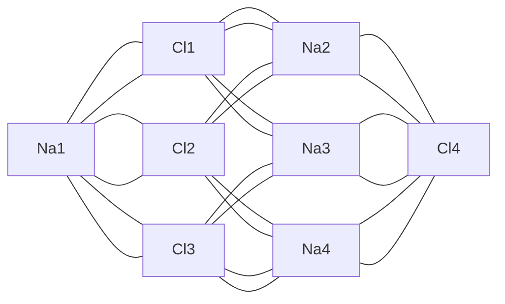
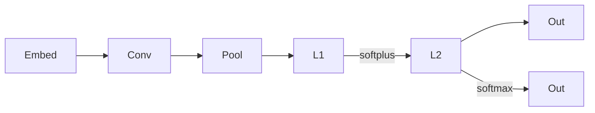

# Crystal Graph Convolutional Neural Network (CGCNN)

## Introduction

The Crystal Graph Convolutional Neural Network (CGCNN) is a deep learning framework designed for predicting material properties based on their crystal structures. It was introduced in the paper ["Crystal Graph Convolutional Neural Networks for an Accurate and Interpretable Prediction of Material Properties"](https://journals.aps.org/prl/abstract/10.1103/PhysRevLett.120.145301).

## Graph Representation

The main idea in CGCNN is to represent the crystal structure by a crystal graph that encodes both atomic information and bonding interactions between atoms. A crystal graph $\mathcal{G}$ is an udirected multigraph which is defined by nodes representing atoms and edges representing connections between atoms in a crystal.

Each node $i$ is represented by a feature vector $v_i$, encoding the property of the atom corresponding to node $i$. Similarly, each edge $(i,j)_k$ is represented by a feature vector $u_{(i,j)_k}$ corresponding to the $k$th bond connecting atom $i$ and atom $j$.

The crystal graph is unlike normal graphs since it allows multiple edges between the same pair of end nodes, a characteristic for crystal graphs due to their periodicity, in contrast to molecular graphs.

<model-viewer 
    src="../assets/nacl.glb"
    alt="NaCl Crystal Structure"
    auto-rotate
    camera-controls
    ar
    style="width: 100%; height: 300px;">
</model-viewer>

## Model Architecture

### Graph Neural Network

The convolutional neural networks built on top of the crystal graph consist of two major components: convolutional layers and pooling layers. The convolutional layers iteratively update the atom feature vector $v_i$ by "convolution" with surrounding atoms and bonds with a nonlinear graph convolution function,

$$
v_i^{(t+1)} = \text{Conv}\left(v_i^{(t)}, v_j^{(t)}, \mathbf{u}_{(i,j)_k}\right), \quad (i,j)_k \in \mathcal{G}. \tag{1}
$$

After $R$ convolutions, the network automatically learns the feature vector $v_i^{(R)}$ for each atom by iteratively including its surrounding environment. The pooling layer is then used for producing an overall feature vector $v_c$ for the crystal, which can be represented by a pooling function,

$$
v_c = \text{Pool}(v_0^{(0)}, v_1^{(0)}, \ldots, v_N^{(0)}, \ldots, v_N^{(R)}) \tag{2}
$$

that satisfies permutational invariance with respect to atom indexing and size invariance with respect to unit cell choice. In this work, a normalized summation is used as the pooling function for simplicity, but other functions can also be used. In addition to the convolutional and pooling layers, two fully connected hidden layers with the depths of $L_1$ and $L_2$ are added to capture the complex mapping between crystal structure and property. Finally, an output layer is used to connect the $L_2$ hidden layer to predict the target property $\hat{y}$.

### Convolutional Layer

The convolutional operation in CGCNN can be expressed as:

$$
v_i^{(t+1)} = v_i^{(t)} + \sum_{j,k} \sigma\left(z_{(i,j)_k}^{(t)} W_f^{(t)} + b_f^{(t)}\right) \odot g\left(z_{(i,j)_k}^{(t)} W_s^{(t)} + b_s^{(t)}\right) \tag{3}
$$

$$
z_{(i,j)_k}^{(t)} = v_i^{(t)} \oplus v_j^{(t)} \oplus u_{(i,j)_k} \tag{4}
$$

where:

- $v_i^{(t)}$ is the feature vector of atom $i$ at layer $t$
- $\sigma$ is the sigmoid function (gate)
- $g$ is the softplus activation function for introducing nonlinear coupling between layers
- $\odot$ is the element-wise multiplication
- $\oplus$ is the concatenation operation
- $z_{(i,j)_k}^{(t)}$ is the concatenation of the feature vectors of atom $i$, atom $j$, and the $k$th bond between atom $i$ and atom $j$ at layer $t$
- $W_f^{(t)}$ and $b_f^{(t)}$ are the learnable weights and biases for the sigmoid function
- $W_s^{(t)}$ and $b_s^{(t)}$ are the learnable weights and biases for the softplus function

## References

1. [Crystal Graph Convolutional Neural Networks for an Accurate and Interpretable Prediction of Material Properties](https://journals.aps.org/prl/abstract/10.1103/PhysRevLett.120.145301)
1. [CGCNN GitHub Repository](https://github.com/txie-93/cgcnn)
